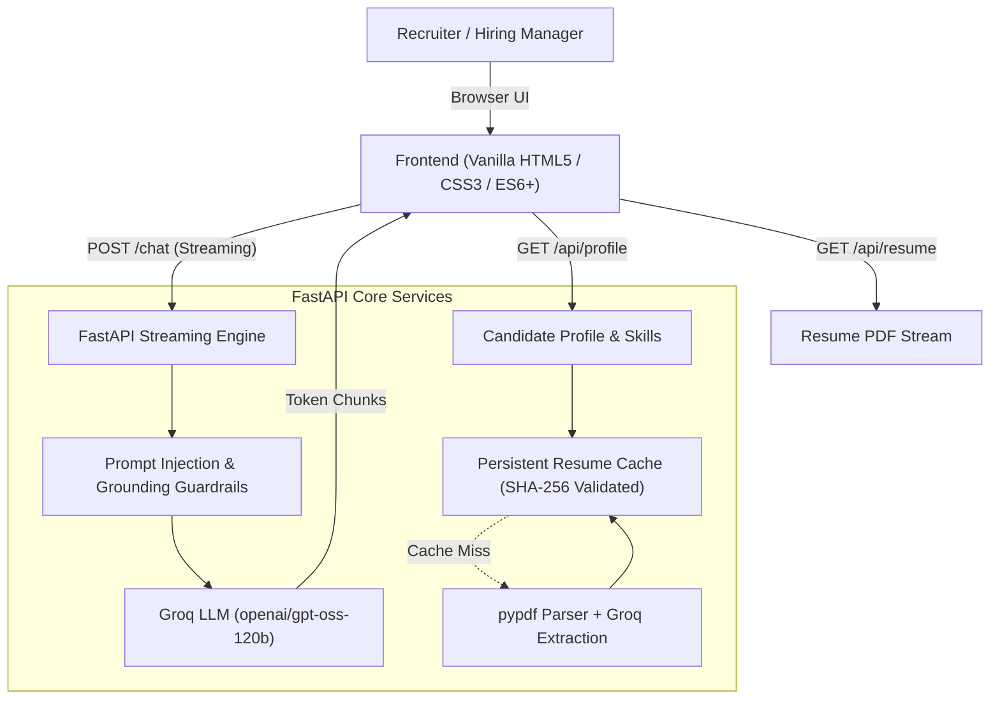

# AI Engineering – Candidate AI Resume Assistant

An intelligent, interactive AI assistant representing **Jayesh Manani** (AI & Cloud Engineer). Grounded strictly in verified resume data, the assistant enables recruiters and technical hiring managers to conduct live, conversational screenings with streaming responses, dynamic skill discovery, and original PDF preview.

---

## Architecture Overview



---

## Key Features

- **Blazing Fast Cold Starts (<5ms)**: Evaluates SHA-256 hash of `data/resume.pdf` against `data/resume_cache.json`. Avoids expensive LLM re-parsing on restarts while auto-invalidating cache when the PDF changes.
- **Multi-Turn Conversational Memory**: Supports continuous dialogue with context preservation across follow-up questions.
- **Grounded & Fortified System Prompt**: Strict anti-hallucination rules and prompt injection defense ensuring only verified resume facts are shared.
- **Dynamic Candidate Profile & Interactive Skills Cloud**: Automatically populates candidate name, headline, contact channels, and over 60+ clickable skill badges that auto-fill suggested interview questions.
- **In-Browser Resume PDF Viewing**: Dedicated `/api/resume` endpoint with a single-click header button for instant PDF review.
- **Stream Controls & UX Polishing**: Integrated `AbortController` to stop ongoing responses, one-click response copy to clipboard, and auto-resizing composer.

---

## Technology Stack

- **Backend**: Python 3.13+, FastAPI, Pydantic v2, Groq SDK, PyPDF, Uvicorn
- **LLM Engine**: Groq Cloud (`openai/gpt-oss-120b` or configurable via environment)
- **Frontend**: Vanilla HTML5, modern CSS3 (glassmorphism, radial mesh gradients, CSS variables), native asynchronous ES6+
- **Package & Environment Management**: `uv`
- **Testing**: `pytest`, `httpx` (FastAPI TestClient)

---

## Getting Started

### Prerequisites

- Python 3.13+
- [uv](https://github.com/astral-sh/uv) (recommended) or standard `pip`
- A [Groq API Key](https://console.groq.com/)

### 1. Clone & Configure Environment

```bash
git clone <repository-url>
cd AI_Engineering

# Copy example environment configuration
cp .env.example .env
```

Edit `.env` and configure your credentials:

```env
GROQ_API_KEY=gsk_your_groq_api_key_here
GROQ_MODEL=openai/gpt-oss-120b
HOST=0.0.0.0
PORT=8000
```

### 2. Install Dependencies

Using `uv`:
```bash
uv sync
```

Or using standard `pip`:
```bash
python -m venv .venv
source .venv/bin/activate
pip install -e .
```

### 3. Run the Application

```bash
uv run uvicorn backend.main:app --reload --host 0.0.0.0 --port 8000
```

Access the interface in your browser at `http://localhost:8000`.

---

## API Specification

| Method | Endpoint | Description |
|---|---|---|
| `GET` | `/` | Serves the interactive candidate web interface |
| `GET` | `/health` | Healthcheck and readiness probe with cache state |
| `GET` | `/api/profile` | Returns structured candidate JSON (skills, experience, contact) |
| `GET` | `/api/resume` | Streams and serves the original candidate PDF |
| `POST` | `/chat` | Streams LLM responses with conversational history support |

### Sample `POST /chat` Payload

```json
{
  "question": "What is Jayesh's experience with Kubernetes and AWS?",
  "history": [
    {"role": "user", "content": "Summarize his background"},
    {"role": "assistant", "content": "Jayesh is an AI & Cloud Engineer with 5+ years of experience..."}
  ]
}
```

---

## Running the Automated Test Suite

Execute the test suite with `uv`:

```bash
uv run pytest tests/ -v
```

The test suite covers:
- `/health` service availability and fallback model enumeration
- `/` HTML delivery
- `/api/profile` data structure, technical skills, and HR behavioral profiles
- `/api/resume` & `/api/resume.pdf` inline PDF streaming (`Content-Disposition: inline`)
- `/api/resume?download=true` explicit file attachment download
- `/chat` input validation (empty / whitespace rejection)
- Context-aware transferable skills evaluation for unlisted technologies
- Multi-model automatic rate-limit failover logic
- SHA-256 disk cache integrity verification
